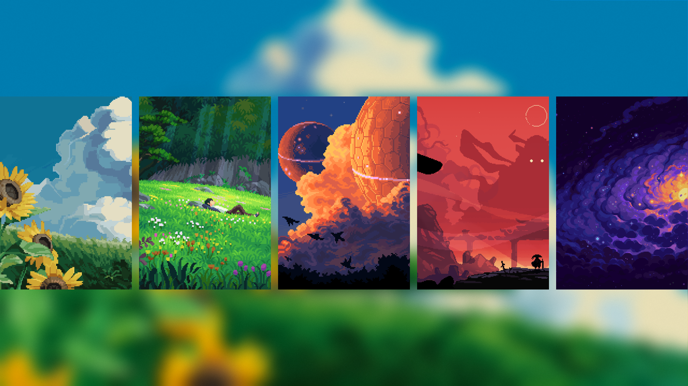
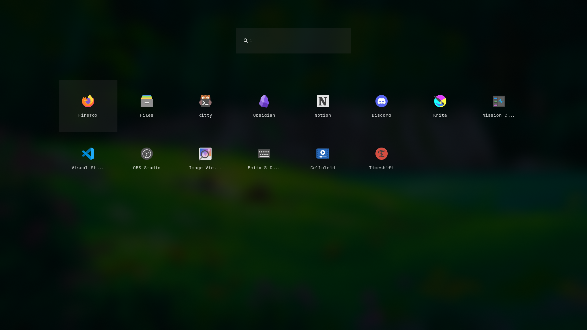
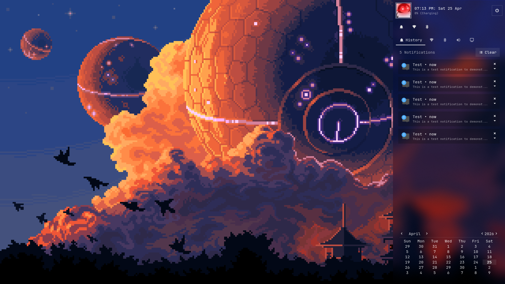
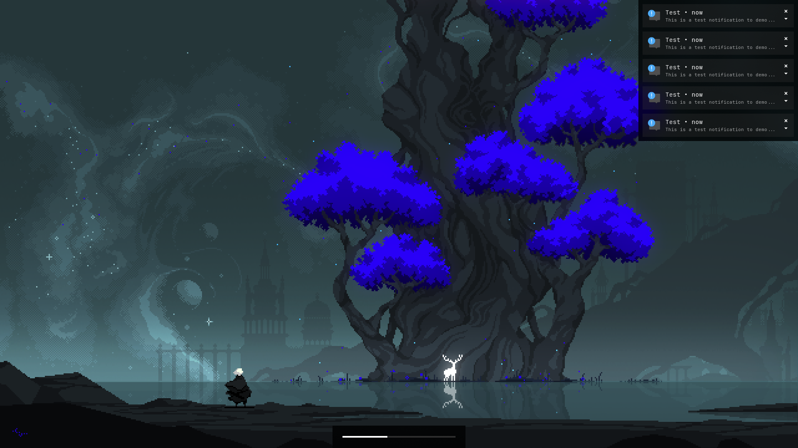

<h1 align=center>
  
  bomb-shell
  
</h1>

> [!WARNING] 
> This project is currently in Alpha. If you encounter any bugs please open a GitHub issue.

<h2>
  
  Gallery:
</h2>

| Background Selector |
|--------------------|
|  |

| App Drawer |
|------------|
|  |

| Control Center |
|---------|
|  |

| Flyouts |
|-----------|
|  |


<h2>
  
  Installation:
</h2>

**1. Install the following dependencies for your distribution:**   
> [!NOTE] 
> You only need to install fabric's dependencies (ie. steps 1. and 2. from the installation guide), as fabric's python package is included in this projects `requirements.txt`.

| Dependency | Used For | Installation Guide |
| --- | --- | --- | 
| [`niri`](https://github.com/niri-wm/niri) | Window manager | [niri](https://niri-wm.github.io/niri/Getting-Started.html) |
| [`fabric`](https://github.com/Fabric-Development/fabric)| GUI toolkit | [fabric](https://wiki.ffpy.org/getting-started/installation-guide/) |
| [`awww`](https://codeberg.org/LGFae/awww) | Wallpaper daemon |  [awww](https://codeberg.org/LGFae/awww) |

> [!IMPORTANT]
> The following steps assume you are in an active niri session.

**2. Clone and navigate to the repo:**
```bash
git clone https://github.com/kianblakley/bomb-shell.git
cd bomb-shell
```
**3. Create a venv and install python dependencies:**
```bash
python -m venv venv
source venv/bin/activate
pip install -r requirements.txt

``` 
**4. Add the following keybindings to your niri `config.kdl`:**
> [!TIP]
> Replace `~/bomb-shell` with the location at which you cloned this repo. 
```
Mod+D {spawn-sh "~/bomb-shell/venv/bin/python -m fabric execute bombshell \"app.app_drawer.toggle()\""; }
Mod+B {spawn-sh "~/bomb-shell/venv/bin/python -m fabric execute bombshell \"app.bg_selector.toggle()\""; }
Mod+E {spawn-sh "~/bomb-shell/venv/bin/python -m fabric execute bombshell \"app.control_center.toggle()\""; }
```
**5. Add the following layer rules to your niri `config.kdl`:**
```
layer-rule {
    match namespace="^awww-daemonoverview$"
    place-within-backdrop true
}

// Optional if you wish to enable blur for the shell.
layer-rule {
    match namespace="^fabric$"
    background-effect {
        blur true
        xray false
    }
}
```
**6. Start the wallpaper daemon for the workspaces and overview:**
```bash
awww-daemon -n workspaces
awww-daemon -n overview
```

**7. Start the shell:**
```bash
python main.py
```

<h2>
  
  Autostart:
</h2>

The simplest method is to add the following lines to your niri `config.kdl`:
> [!TIP]
> Replace `~/bomb-shell` with the location at which you cloned this repo. 
```bash
spawn-sh-at-startup "awww-daemon -n workspaces"
spawn-sh-at-startup "awww-daemon -n overview"
spawn-sh-at-startup "~/bomb-shell/venv/bin/python main.py"
```
Alternatively, if you start niri as a sytemd unit with `niri-session` or equivalent (recommended, see [here](https://niri-wm.github.io/niri/Example-systemd-Setup.html) for more details) follow these steps:

**1. Create a systemd user configuration folder if it doesn't exist already:**
```bash
mkdir -p ~/.config/systemd/user
```
**2. Adjust and copy the provided `.service` files to the systemd config folder:**
> [!TIP]
> Replace `%h/bomb-shell` with the location at which you cloned this repo in `bombshell.service`.  
> Replace `/usr/bin/awww-daemon` with the path to your `awww-daemon` binary in `awww@.service`.
```bash
cp ~/bomb-shell/systemd/* ~/.config/systemd/user
```
**3. Link the services to niri:**
```bash
systemctl --user add-wants niri.service bombshell.service
systemctl --user add-wants niri.service awww@workspaces.service
systemctl --user add-wants niri.service awww@overview.service
```
The shell can now be restarted at anytime with:
```bash
systemctl --user restart bombshell.service
```

<h2>
  
  Configuration:
</h2>

The `config.json` file in the root of the project allows for limited configuration:

| Key | Default Value | Function |
| --- | --- | --- |
| `"wallpapers_path"` | `"~/Pictures/wallpapers/"` | Set the folder from which the background selector reads wallpapers |
| `"profile_picture"` | `"./assets/penguin.png"` | Set the path to the user's picture displayed in the control center |
| `"transparency"` | `true` | Allows the user to switch between the default `opaque` and `transparent` styles |

The shell inherits its icon theme and font from GTK settings, which can be changed by running:
```bash
gsettings set org.gnome.desktop.interface icon-theme "Your icon theme"
gsettings set org.gnome.desktop.interface font-name "Your font name"
```
> [!NOTE]
> The icon theme shown in the demo is [Papirus](https://github.com/PapirusDevelopmentTeam/papirus-icon-theme), and the font is [Jet Brains Mono Nerd Font](https://www.nerdfonts.com/font-downloads).  
> Additionally, the wallpapers shown in the demo can be found in `wallpapers/`.  

<h2>
  
  Acknowledgements:
</h2>

* [@its-darsh](https://github.com/its-darsh) and the fabric community for building fabric and helping me out on the discord.  
* [@Axenide](https://github.com/Axenide) for writing the upower and networking services.  
* [@Inparsian](https://github.com/Inparsian) for inspiring the design of the control center.  
* [@Camille Unkown](https://x.com/CamiUnknown?s=20), [@waneella](https://x.com/waneella_?s=20), [@finch](https://x.com/illufinch?s=20), [@TofuPixel](https://x.com/TofuPixel?s=20), [@Yes I Do](https://x.com/yes_i_do_pixels?s=20), [@Slynyrd](https://x.com/rayslynyrd) for creating the stunning wallpapers.


